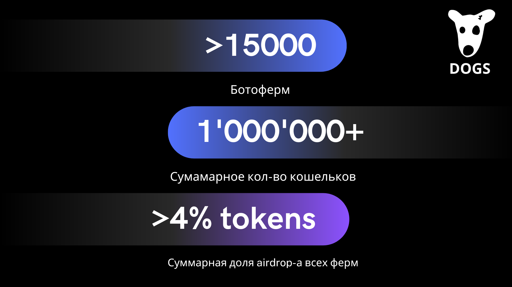
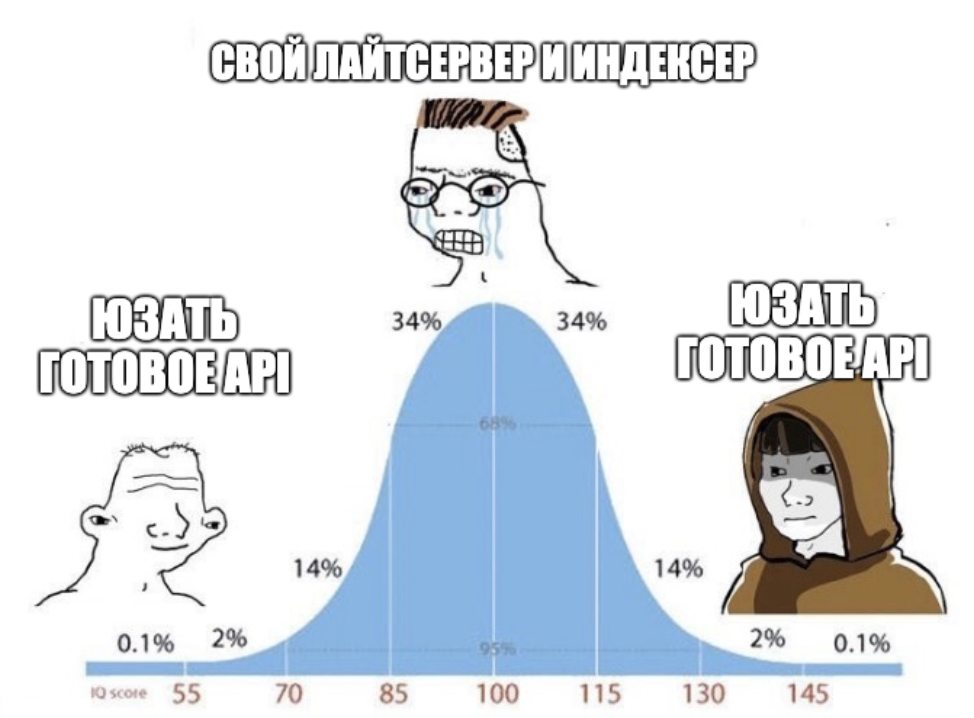
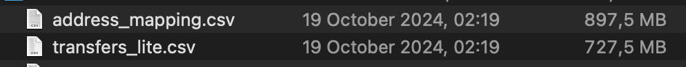
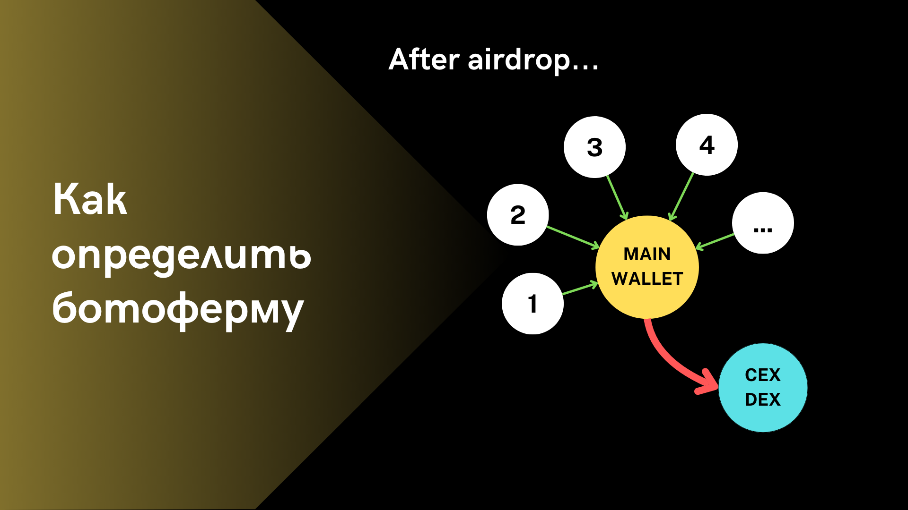
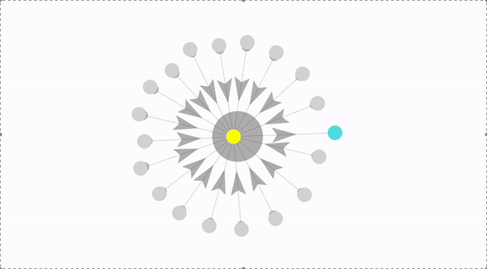
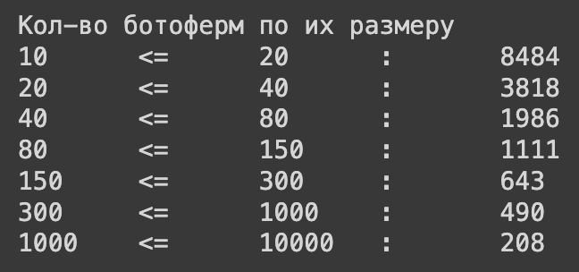

# 🏭 Как я выявлял ботоферм через анализ активности кошельков на TON, и нашел >15000 ботоферм

> *В tg каналах много обсуждают тему того что на TON 200 живых человек, а все остальные боты. Я долгое время скептическим к этому относился, но...*

> *За последнее время я посетил >5 конференции по TON. Ообщался с многими интересными людьми, от фаундеров топ проектов, то обычных юзеров. И было немало ребят с кем я обсуждал тему эирдропов, и послушал кто и как фармил поинты... Без подробностей, появилось желание проанализировать этот вопрос подробнее* 

Эта статья о том как я собирал историю транзаций токенов после airdrop-а, находил связи между кошельками и пытался найти среди всей массы те, что очень вероятно абузили систему (то есть **ботофермы**) 

*Некоторые картинки взяты из слайдов презентации нашего [проекта](https://t.me/eyeofton_info) по on-chain аналитике*

## 📊 TL;DR

Мы проанализировали [DOGS](https://tonviewer.com/EQCvxJy4eG8hyHBFsZ7eePxrRsUQSFE_jpptRAYBmcG_DOGS)

**Период**: August 26, 2024 - October 16, 2024

**Транзакций в анализе**: >23'886'000



Найдено 15'000 ферм, что в кол-ве кошельков >1'000'000

**4% supply = 10'000'000$** *(по курсу 0.0005,October 26, 2024)* - кол-во токенов которое получили все ботофермы после эирдропа

## 🔍 Сбор данных

Для анализа активности, надо хотя бы заиметь что анализировать. В нашем случае это транзакции на TON. 

Как оказалось, инфраструктуры для анализа он-чейн данных на TON очень мало, и пользоваться ей не супер просто. Есть два способа:

1. Поднять свой индексер [link](https://github.com/re-doubt/ton-indexer)
2. Использовать готовое API 



Есть еще вариант

3. Готовые структурированные данные Dune или The Graph

Ладно... Нету, все популярные сервисы, которые структурируют данные, не поддерживают сейчас TON, будем верить что скоро поддержат, или появятся аналоги 🤞

Сейчас из аналогов, **[Ton Console Analytics](https://tonconsole.com/analytics/history)**, **[Redoubt Tonalytics](https://tonalytica.redoubt.online)**, **[DTON GraphQL](https://dton.io/graphql/)**. Я потыкал все, но они либо дорогие, либо долго работают на обработке большого кол-ва данных. 

### Так откуда я в итоге взял данные?

TON API 

## 🤓 О самих данных

Из TON API я собрал транзакции ряда токенов **DOGS**, **HMSTR**, **CATI**

Данные **DOGS**: 23'886'000 транзакций, 11'955'620 уникальных кошельков. Сырые сложенные в файлик данные занимают 14GB.

На парсинг данных ушло несколько часов, а заплатил я за это 0 руб. 0 коп (*пишите если интересно узнать как так*). 

Если сжать адреса в числа!, и выкинуть ненужную информацию, весь граф транзакций уже весит 700MB, а маппинг аддресов (*чтобы восстановить изначальные адреса*) - 900MB 



И с этим уже можно работать 🙂

## 🤔 Как находить эти ваши ботофермы? 

Если повглядываться в данные, и попробовать найти закономерности, можно найти интересные паттерны



Один из самых простых примеров на картинке выше.

Мы видим 🟡 кошелек, на который после эирдропа с ряда других ⚪ кошельков переводятся токены, а с кошелька 🟡 все токены выводятся на 🔵 (CEX или DEX биржу).

Какой шанс что у владелеца 🟡 была ботоферма? Правильно - большая.

Такие паттерны я и искал.

### Автоматический поиск таких паттернов

Я написал алгоритм который находит простые, и некоторые более сложные паттерны. Алгоритм делает это на основе операциям между кошельками, и схожести операций между собой.

Также я сделал визуализацию транзакций для группы кошельков, который алгоритм нашел 

**Примеры некоторых ботоферм с адрессами кошельков:**

*c телефона могут быть подлагивания, но мы работаем над этим :)*

1. Мини ферма на 20 кошельков 
https://markysha.github.io/force-graph/example/test_1_mini/
также этот кошелек можно найти в tonviewer-е
https://tonviewer.com/EQAD6xF9xa5ZCtBK7lXp0MwxgVsXM9o_0480Wov_8vgg-ZSw

2. Ферма на ~150 кошельков и более сложной структурой
https://markysha.github.io/force-graph/example/test_0_sun/


Для тех кто не спешит заходить лишний раз по каким-то ссылкам, вот скрин того как это выглядит

1.



2.


## 📝 Итоги найденных ботоферм

Всего найдено было >15'000 ботоферм

Каждая ботоферма размером от 10 до 10'000 кошельков

Вот статистика по размеру найденых ботоферм 



Чем больше ботоферма, тем более аккуратно надо ее интерпретировать, потому что могут быть учтены лишние связи между кошельками. C небольшими фермами такое маловероятно.

Поэтому вот график % от всей эмиссии если взять только найденные ботофермы < определенного значения


```
фермы размера < 100   ~ 1.5% 
фермы размера < 300   ~ 2%
фермы размера < 1000  ~ 3%
фермы размера < 10000 ~ 4%
```

Фермы размера < 300 почти наверное ботофермы, а среди более больших ботоферм могут быть какие-то кошельки, которые ложно учтены. Но в любом случае

> Итого мы нашли фермы которые получили дроп в размере **2-4%** эмиссии всего токена

_P.S. ❗️️️️️️️ Анализ не покрывает 100% всех ботоферм, но дает начальное представление о ситуации, и может быть дополнен. Также он не учитывает аккаунты, которые получили токены после дропа сразу на биржу. Вероятно при более глубоком анализе размер дропа полученный нечестными игроками окажется еще **больше**_

### Пролог

> 😎 Анализ ботоферм это часть проекта **eye of ton**. Проект который анализирует TON кошельки, их активность и в связки с tg аккаунтами владельцев кошельков.
> 
> Мы помогаем проектам обогощать их данные разными источниками, помогая знать о своих юзерах чуть больше :) и достигать новых высот в качестве и количестве.
>
> 👉 [eye of ton в telegram](https://t.me/eyeofton_info)
